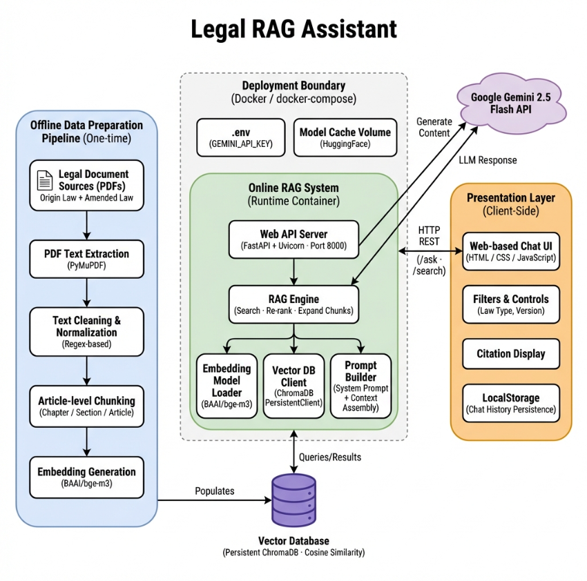
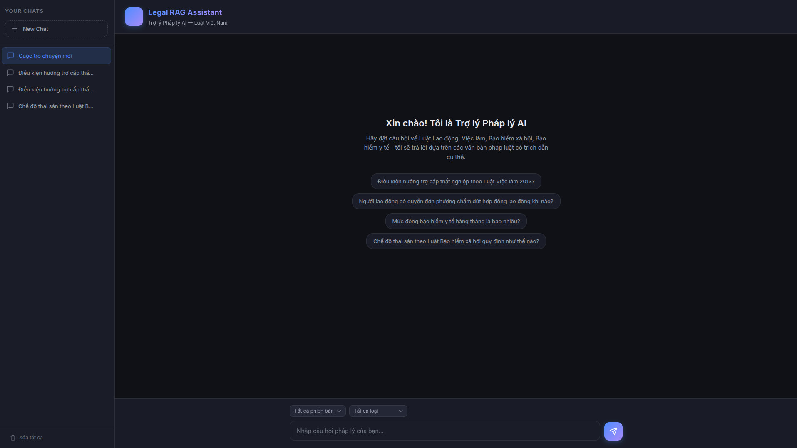
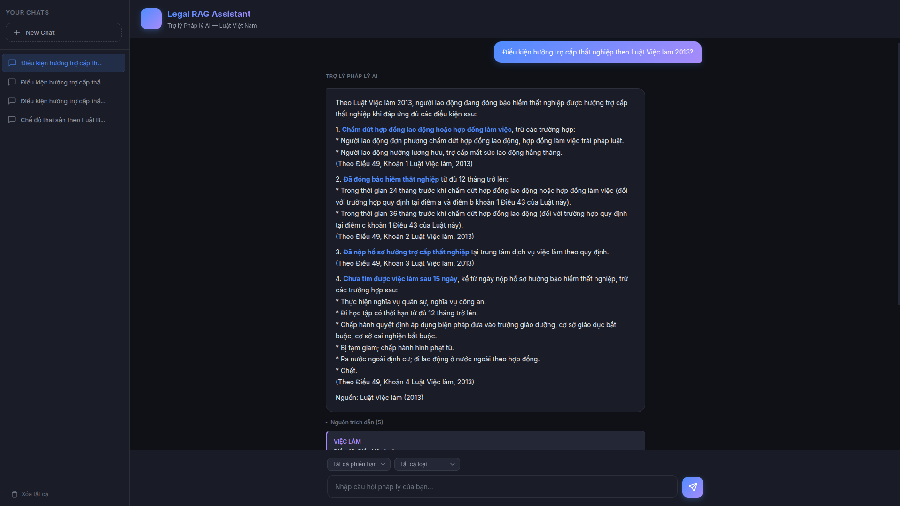
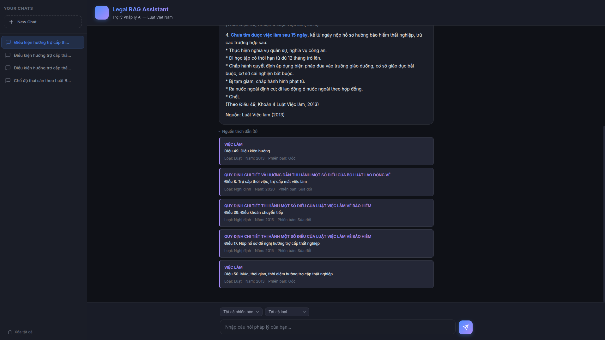
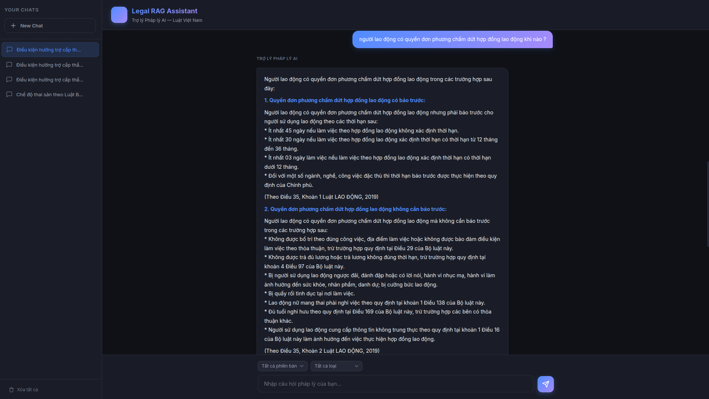
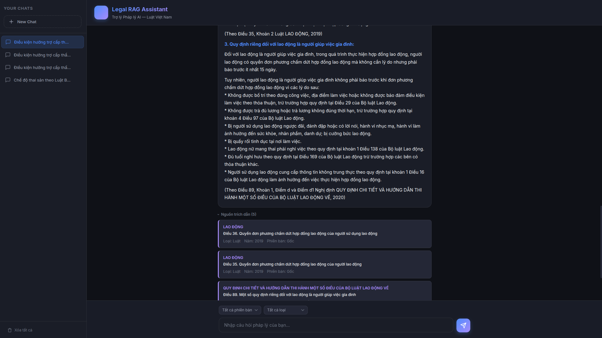

# ⚖️ Legal RAG Assistant

> **AI-powered legal assistant for Vietnamese law** — Ask questions about Labor Law, Employment Law, Social Insurance, and Health Insurance with cited article-level references.

Built with **FastAPI + ChromaDB + Gemini 2.5 Flash + BAAI/bge-m3**, this system uses Retrieval-Augmented Generation (RAG) to answer legal questions grounded in actual legal documents, returning precise citations (Article, Clause, Law name, Year).

---

## 🏗️ System Architecture

<p align="center">
  
</p>

The system consists of three main components:

- **Offline Data Preparation Pipeline** — One-time process to extract, clean, chunk, and embed legal PDFs into a vector database
- **Online RAG System** — Runtime FastAPI server that searches the vector DB, expands multi-part chunks, re-ranks results, and calls Gemini to generate cited answers
- **Presentation Layer** — Client-side chat UI with filters, citation display, and chat history persistence via LocalStorage

---

## � Demo

### Welcome Screen

<p align="center">
  
</p>

> Chat interface with sidebar, suggestion chips, and law type/version filters.

### Question 1 — Unemployment Benefits

<p align="center">
  
</p>
<p align="center">
  
</p>

> Asking about unemployment benefit conditions under the Employment Law 2013. The assistant provides a structured answer citing specific Articles/Clauses, followed by expandable citation cards with source references.

### Question 2 — Unilateral Contract Termination

<p align="center">
  
</p>
<p align="center">
  
</p>

> Asking about employee rights to unilateral termination of labor contracts. The assistant cites from the Labor Code 2019 with detailed conditions and citation cards.

---

## �📁 Project Structure

```
legal-rag-assistant/
├── docs/
│   └── architecture.png          # System architecture diagram
├── data/
│   ├── raw_pdf/                  # Original legal PDFs
│   │   ├── origin_law/           #   Original laws (Luật gốc)
│   │   └── update_law/           #   Amended laws (Nghị định sửa đổi)
│   ├── extracted_text/           # Raw text extracted from PDFs
│   ├── clean_text/               # Cleaned & normalized text
│   ├── chunks/                   # JSONL file of article-level chunks
│   │   └── legal_chunks.jsonl
│   └── vectordb/                 # Persistent ChromaDB storage
├── src/
│   ├── data_processing/          # Offline pipeline scripts
│   │   ├── extract_pdf.py        #   Step 1: PDF → text (PyMuPDF)
│   │   ├── clean_text.py         #   Step 2: Regex-based cleaning
│   │   └── chunk_law.py          #   Step 3: Article-level chunking
│   ├── embedding/
│   │   ├── embed_chunks.py       #   Step 4: Embed & store in ChromaDB
│   │   └── search.py             #   Standalone CLI search tool
│   ├── api/
│   │   ├── main.py               #   FastAPI app (endpoints + static serving)
│   │   ├── rag_chain.py          #   RAG engine (search → re-rank → expand → Gemini)
│   │   └── prompts.py            #   System prompt & context builder
│   └── frontend/
│       ├── index.html            #   Chat UI
│       ├── style.css             #   Styling
│       └── script.js             #   Client logic + LocalStorage persistence
├── .env                          # GEMINI_API_KEY
├── Dockerfile
├── docker-compose.yml
└── requirements.txt
```

---

## ⚙️ Tech Stack

| Layer | Technology | Purpose |
|---|---|---|
| LLM | Google Gemini 2.5 Flash | Answer generation with citations |
| Embedding | BAAI/bge-m3 | Multilingual dense embeddings (1024-dim) |
| Vector DB | ChromaDB (Persistent, Cosine) | Semantic search over legal chunks |
| Backend | FastAPI + Uvicorn | REST API server (port 8000) |
| Frontend | HTML / CSS / JavaScript | Chat UI with sidebar & filters |
| PDF Parsing | PyMuPDF (fitz) | Extract text from legal PDFs |
| Deployment | Docker + docker-compose | Containerized deployment |

---

## 🚀 Getting Started

### Prerequisites

- **Python 3.10+**
- **Docker & Docker Compose** (recommended) or a local Python environment
- **Gemini API Key** — Get one from [Google AI Studio](https://aistudio.google.com/)

### 1. Clone & Setup

```bash
git clone <repository-url>
cd legal-rag-assistant
```

Create a `.env` file with your API key:

```bash
GEMINI_API_KEY=your_api_key_here
```

### 2. Offline Data Pipeline (one-time)

Place your legal PDF files in `data/raw_pdf/origin_law/` and `data/raw_pdf/update_law/`, then run the pipeline steps in order:

```bash
# Install dependencies
pip install -r requirements.txt

# Step 1: Extract text from PDFs
python -m src.data_processing.extract_pdf

# Step 2: Clean & normalize text
python -m src.data_processing.clean_text

# Step 3: Chunk by article (Chapter / Section / Article)
python -m src.data_processing.chunk_law

# Step 4: Generate embeddings & store in ChromaDB
python -m src.embedding.embed_chunks
```

### 3. Run the Server

**Option A: Docker (Recommended)**

```bash
docker-compose up --build
```

**Option B: Local**

```bash
uvicorn src.api.main:app --host 0.0.0.0 --port 8000
```

Open **http://localhost:8000** in your browser.

---

## 📡 API Endpoints

| Method | Endpoint | Description |
|---|---|---|
| `GET` | `/` | Serve the frontend Chat UI |
| `POST` | `/ask` | Full RAG pipeline: search → re-rank → Gemini → answer with citations |
| `GET` | `/search?q=...` | Search ChromaDB only (no LLM call) |
| `GET` | `/health` | Health check |

### POST `/ask`

**Request:**

```json
{
  "question": "Điều kiện hưởng trợ cấp thất nghiệp?",
  "version": "origin_law",
  "law_type": "Luật"
}
```

**Response:**

```json
{
  "answer": "Theo Điều 49, Khoản 1 Luật Việc làm 2013...",
  "citations": [
    {
      "article": "Điều 49. Điều kiện hưởng",
      "law_title": "LUẬT VIỆC LÀM",
      "law_type": "Luật",
      "issued_year": 2013,
      "version": "origin_law"
    }
  ],
  "chunks_used": 5
}
```

### GET `/search`

| Parameter | Type | Description |
|---|---|---|
| `q` | string (required) | Legal question |
| `version` | string (optional) | Filter: `origin_law` / `update_law` |
| `law_type` | string (optional) | Filter: `Luật` / `Nghị định` / `Thông tư` |

---

## 🖥️ Frontend Features

- **Chat Interface** — Conversational UI with message history
- **Sidebar** — Manage multiple chat sessions (create, switch, delete)
- **Filters** — Filter by law version (origin/amended) and law type
- **Citation Display** — Expandable citation cards showing Article, Law, Year
- **LocalStorage Persistence** — Chat history survives page refresh
- **Responsive Design** — Works on desktop and mobile

---

## 📂 Data Pipeline Detail

### Legal Document Sources

| Category | Contents | Count |
|---|---|---|
| Origin Laws (`origin_law/`) | Luật Việc làm 2013, Luật BHXH 2014, Bộ luật Lao động 2019, VBHN Luật BHYT | 4 PDFs |
| Amended Laws (`update_law/`) | NĐ 28/2015, NĐ 145/2020, NĐ 12/2022, NĐ 74/2024, NĐ 158/2025 | 5 PDFs |

### Pipeline Steps

```
PDF Files → [PyMuPDF] → Raw Text → [Regex Cleaning] → Clean Text
    → [Article Chunking] → JSONL Chunks → [bge-m3 Embedding] → ChromaDB
```

1. **Extract** — PyMuPDF (`fitz`) extracts raw text page-by-page
2. **Clean** — Regex removes headers, footers, footnote markers; merges split chapter titles; inserts structural blank lines
3. **Chunk** — Splits by `Điều` (Article) boundaries, tracks `Chương` (Chapter) and `Mục` (Section) context; long articles are split at clause boundaries (max 2000 chars)
4. **Embed** — BAAI/bge-m3 generates 1024-dim normalized embeddings; stored in ChromaDB with cosine similarity and rich metadata

---

## 🔧 Configuration

### Environment Variables

| Variable | Description |
|---|---|
| `GEMINI_API_KEY` | Google Gemini API key (required) |

### RAG Search Parameters (in `src/api/rag_chain.py`)

| Parameter | Default | Description |
|---|---|---|
| `SEARCH_TOP_K` | 7 | Initial candidates from ChromaDB |
| `FINAL_TOP_K` | 5 | Results kept after re-ranking |
| `MAX_CHUNK_CHARS` | 2000 | Max characters per chunk (in chunking step) |
| `GEMINI_MODEL` | `gemini-2.5-flash` | Gemini model for answer generation |
